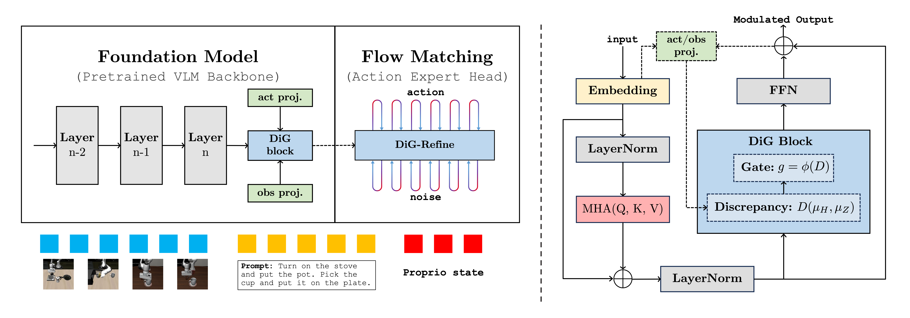

# DiG-Flow: Discrepancy-Guided Flow Matching for Robust VLA Models

<div align="center">

**[Wanpeng Zhang](https://zhangwp.com)$^{1,2}$, [Ye Wang](https://scholar.google.com/citations?user=RTuvoywAAAAJ)$^{2,3}$, [Hao Luo](https://scholar.google.com/citations?user=TwuNaTYAAAAJ)$^{1,2}$, [Haoqi Yuan](https://yhqpkueecs.github.io)$^{1,2}$, [Yicheng Feng](https://takenpeanut.github.io)$^{1,2}$, [Sipeng Zheng](https://zhengsipeng.github.io)$^{2}$, [Qin Jin](https://www.jin-qin.com)$^{3}$, [Zongqing Lu](https://z0ngqing.github.io)$^{1,2†}$** <br>


**${}^1{\text{Peking University}}$** $\hspace{1em}$ 
**${}^2{\text{BeingBeyond}}$** $\hspace{1em}$ 
**${}^3{\text{Renmin University of China}}$** 
<br>

[](https://beingbeyond.github.io/DiG-Flow)
[](https://arxiv.org/abs/2512.xxxxx)
[](./LICENSE)

</div>

<p align="center">
    
<p>


<b>DiG-Flow</b> is a plug-and-play module for flow-matching based VLAs that rebalances control between the autoregressive foundation model and the flow expert. It embeds model inputs and flow outputs into a unified discrepancy space and uses this signal to gate the flow path, preventing shortcut transports that bypass the pretrained model and steering the expert toward more general, robust actions. <b>DiG-Flow</b> integrates seamlessly into diverse VLA architectures, including π, GR00T, and [**Being-H**](https://beingbeyond.github.io/Being-H0).

## News

- **[2025-12-01]**: We publish **DiG-Flow**! Check our paper [here](https://arxiv.org/abs/2512.xxxxx). Code is coming soon! 🔥🔥🔥

## Citation
If you find our work useful, please consider citing us and give a star to our repository! 🌟🌟🌟

```bibtex
@article{zhang2025digflow,
  title={DiG-Flow: Discrepancy-Guided Flow Matching for Robust VLA Models},
  author={Zhang, Wanpeng and Wang, Ye and Luo, Hao and Yuan, Haoqi and Feng, Yicheng and Zheng, Sipeng and Jin, Qin and Lu, Zongqing},
  journal={arXiv preprint arXiv:2512.xxxxx},
  year={2025}
}
```
